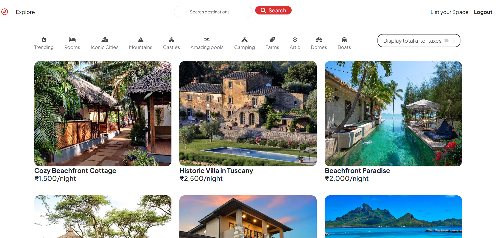

# WanderWave - Travel Explorer Website 

**WanderWave** is a sophisticated travel platform designed for explorers and adventurers to find hotels, villas, and islands at their desired locations. With precise geolocation features and a seamless user interface, WanderWave provides an intuitive experience for users looking for new places to explore.

## Features

- **Location-Based Listings**: Find hotels, villas, and islands near your desired destination.
- **Geolocation Integration**: Precise location display with Mapbox to ensure accurate property placements.
- **Customer Reviews**: A user-friendly rating and feedback system for properties listed on the platform.
- **Seamless Image Uploads**: Cloudinary integration for easy media management and storage.
- **Optimized UI/UX**: Responsive and engaging design for an excellent user experience across all devices.
- **MERN Stack**: Built with MongoDB, Express.js, React, and Node.js for a scalable and robust backend and frontend solution.
- **Security**: Various npm packages to ensure functionality, performance, and security enhancements.

## Technologies Used

- **Frontend**: React.js, HTML5, CSS3, Bootstrap
- **Backend**: Node.js, Express.js
- **Database**: MongoDB (Deployed on MongoDB Atlas)
- **Geolocation**: Mapbox
- **Media Management**: Cloudinary
- **Other**: npm packages for performance, security, and optimization

## Screenshots

## Project Goals

- To build a platform that caters to the needs of modern explorers and adventure seekers.
- To integrate geolocation services that help users find the best properties easily.
- To provide a clean, easy-to-use interface with dynamic user feedback through reviews.
- To ensure scalability and performance using the MERN stack.
